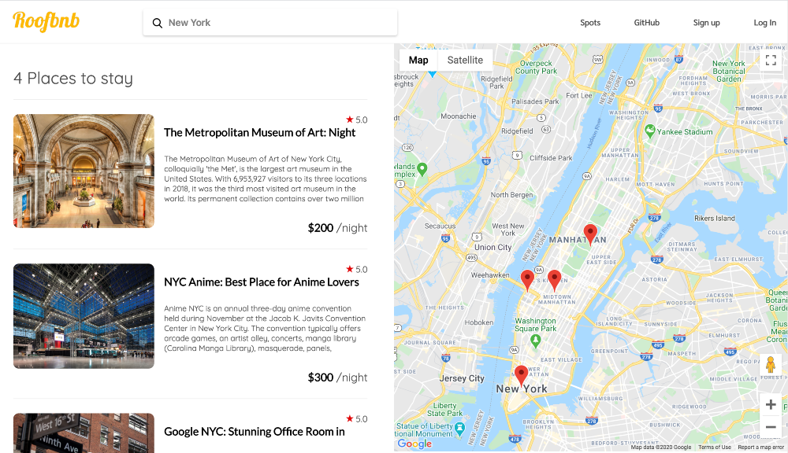

# Roofbnb 


```Roofbnb``` is an Airbnb clone. It offeres an online marketplace where users can arrange or offer homestays. Hosts post their guest rooms with the information of availability and price. Guests look through the hosting list and find the best place for their taste and rent out the rooms. 


## Live Demo
[Live Demo](https://roofbnb.herokuapp.com/) 

## Technologies
roofbnb is built with Ruby on Rails and PSQL as backend and JavaScript, React and Redux for frontend. Google Maps JS API is used for rendering maps. Stylings are written predominantly on SCSS and rest on CSS. roofbnb Live demo is using Heroku for deployment, and static assets are stored in AWS.

## Features

### Spot search with Google Map



On Search Index Page, user can look up spots and locate them on Google Map to visualize it. User can always access to the search bar located on top navigation bar. User can look up spots with any keyword, such as city names, address, and zipcode.

### Booking Spots


On Spot's profile page, user can access to Booking Modal form by clicking 'Check Availability'. Calendars are interactive; user selects the date on the calendar and chose number of guests on the dropdown choices. 

### User Auth


user can signs up or logs in through the top nav bar. It provides modal page of session form. 

* Search spots and filter them on Google Map
* Look up available dates and book a reservation of staying
* User can view their booking list